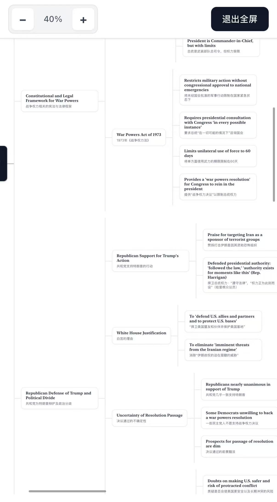
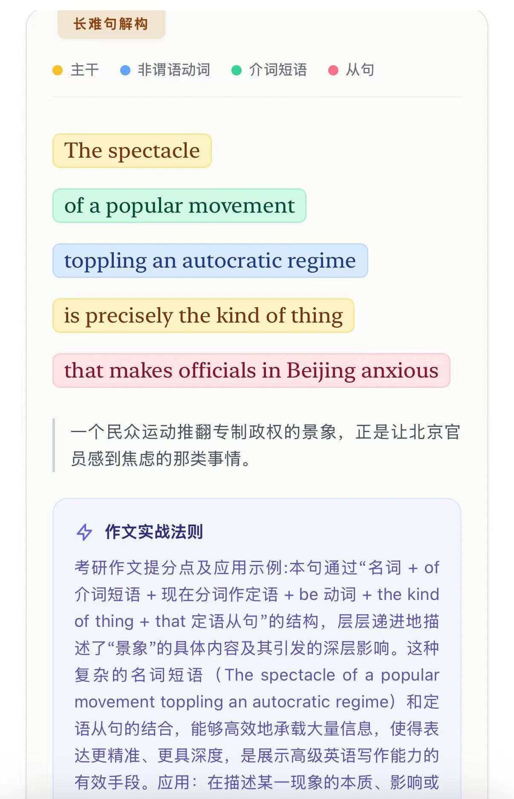
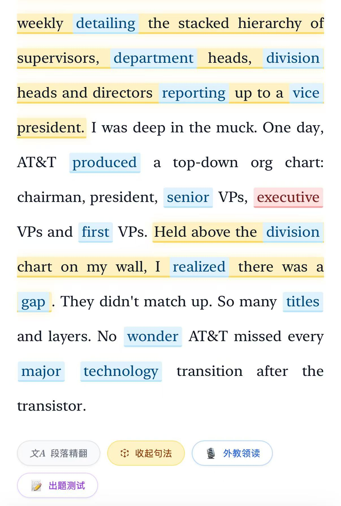

<div align="center">

# 杨的外刊阅读器

**把一篇外刊，从“逐句看懂”推进到“看清结构、吃透表达”。**

面向考研英语、外刊精读与长难句训练的轻量阅读工具。

[🚀 立即在线使用](https://yang-two-phi.vercel.app) · [📖 快速上手](#快速上手) · [✨ 功能预览](#功能预览)

</div>

---

## 它能帮你做什么

| 阅读阶段 | 你可以完成的事 |
| --- | --- |
| **读文章** | 粘贴外刊正文，切换纯净阅读与深度精读模式 |
| **抓重点** | 高亮考研生词、预设词库与自定义词库 |
| **拆句子** | 识别主干、非谓语、介词短语与从句，辅助理解长难句 |
| **理结构** | 生成全文逻辑剖析与双语思维导图 |
| **做训练** | 段落精翻、阅读理解出题、重点表达回顾 |
| **听与读** | 使用 Gemini TTS 进行外教领读，并支持图片 / PDF 文本提取 |

> 不只是把文章翻译出来，而是把“词汇—句法—段落—全文逻辑”连成一套学习流程。

## 功能预览

### 1. 文章总结：双语思维导图

自动提炼文章主线、关键观点与论证关系，将长文章整理成更容易复盘的结构图。

<p align="center">
  <a href="./mindmap-demo.jpg.jpg">
    
  </a>
</p>

### 2. 长难句解构

通过颜色区分主干、非谓语动词、介词短语和从句，并结合中文释义与写作提示，帮助你真正看懂句子是怎么搭起来的。

<p align="center">
  <a href="./sentence-analysis-demo.jpg">
    
  </a>
</p>

### 3. 正文精读与重点高亮

正文中可直接查看重点词汇、句子结构与功能入口，完成精翻、句法分析、外教领读和出题测试。

<p align="center">
  <a href="./reader-main-demo.jpg">
    
  </a>
</p>

> 点击任意示意图可以查看原图。

## 快速上手

1. 打开 [杨的外刊阅读器](https://yang-two-phi.vercel.app)。
2. 粘贴需要精读的英文文章，或导入图片 / PDF 提取文字。
3. 根据需要切换“纯净阅读”或“深度精读”。
4. 点击段落或功能按钮，进行精翻、长难句拆解、全文分析、领读或出题。
5. 首次使用 AI 功能时，在右上角 **API 设置** 中填写自己的模型服务配置。

## 适合这些场景

- 考研英语阅读与作文素材积累
- 英语外刊日常精读
- CET-6、雅思等考试的长难句训练
- 文章结构复盘与表达整理
- 自建词库、高频词和薄弱词集中复习

## 使用前需要知道

### AI 功能需要自行配置

阅读器支持：

- Google Gemini 原生协议
- OpenAI 兼容协议

项目本身不附带公共 API Key。请在应用右上角的 **API 设置** 中填写你自己的服务地址、密钥与模型名称。

### 本地数据与隐私

阅读历史、排版设置、API 设置和自定义词库默认保存在当前浏览器中。清理浏览器数据或更换设备后，本地记录可能无法保留。

使用精翻、句法分析、思维导图等 AI 功能时，相关文本会发送到你所配置的模型服务，请不要提交敏感或保密内容。

## 常见问题

<details>
<summary><strong>为什么点击 AI 功能后没有反应？</strong></summary>

请先检查右上角的 API 设置，确认服务地址、API Key 和模型名称填写正确，并确保当前网络可以访问对应服务。

</details>

<details>
<summary><strong>不配置 API，也能使用吗？</strong></summary>

可以。纯净阅读、文本展示、词汇高亮、排版设置和本地阅读记录等基础功能仍可使用；精翻、长难句分析、思维导图、出题和 TTS 等 AI 功能需要模型服务。

</details>

<details>
<summary><strong>为什么换了浏览器后，历史记录不见了？</strong></summary>

默认数据保存在当前浏览器的本地存储中，不会自动跟随账号同步。项目支持可选的 Firebase 沙盒同步，但需要另行配置。

</details>

---

<details>
<summary><strong>开发者信息与本地运行</strong></summary>

### 本地运行

项目保留 React + Tailwind CDN 的单页形态，无需完整构建流程。下载仓库后，可以直接打开 `index.html`，或在根目录运行：

```bash
python -m http.server 5173
```

然后访问：

```text
http://localhost:5173
```

### 静态部署

根目录包含 `index.html`，可部署至 GitHub Pages、Vercel 或其他静态托管平台。

### 技术说明

源码引用 React、ReactDOM、Babel、Tailwind、Firebase，以及外部词库和真题语料 CDN。未配置 Firebase 时，应用会自动使用 `localStorage` 保存个人设置与阅读记录。

</details>

<div align="center">


</div>
