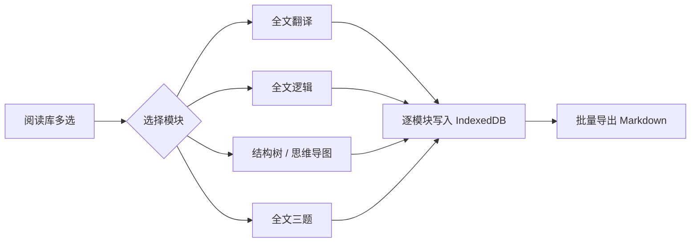

<div align="center">

# 杨的外刊阅读器

### 外刊精读 · 考研英语 · 本地优先 · 可携带学习档案

<sub>把一篇外刊从「读懂」推进到「拆句、做题、批注、复盘与长期保存」</sub>

<br />


</div>

> [!TIP]
> **这不是一个只负责“翻译文章”的页面。**  
> 它把文字选区、段落精读、全文结构、模拟习题、学习笔记、PDF/OCR、Markdown 备份和批量解析放进同一条学习链路。

---

## 30 秒认识它

| 📖 阅读 | 🧠 理解 | ✍️ 学习 | 💾 保存 |
|---|---|---|---|
| 单栏 / 双栏、纯净 / 深度精读、词汇高亮 | 段落翻译、长难句拆解、全文逻辑 | 选区笔记、模拟习题、真题例句、写作提炼 | IndexedDB、本地缓存、完整 Markdown 恢复 |

```text
选择文字 → 翻译 / 朗读 / 添加笔记
点击段落 ⋯ → 翻译 / 长难句 / 练习 / 领读
打开全文工具 → 全文翻译 / 逻辑 / 结构 / 三题模拟
完成学习 → 下载 Markdown → 换设备后重新导入
```

---

## ✨ 核心体验

### 1. 三级阅读交互

<table>
<tr>
<td width="33%" valign="top">

#### 文字选区

选中单词、句子或几行文字后，显示迷你工具条：

<kbd>复制</kbd> <kbd>翻译</kbd> <kbd>朗读</kbd> <kbd>添加笔记</kbd> <kbd>更多</kbd>

</td>
<td width="33%" valign="top">

#### 段落工具

每段右侧保留低存在感的 `⋯`：

- 翻译本段
- 长难句拆解
- 本地 / 外教领读
- 生成练习
- 已生成内容显示 **已缓存**

</td>
<td width="33%" valign="top">

#### 全文工具

全文能力集中管理：

- 全文翻译
- 全文逻辑
- 全文结构 / 思维导图
- 三道模拟题
- Markdown 完整备份

</td>
</tr>
</table>

> [!IMPORTANT]
> Hover 只负责提示，不是唯一入口。鼠标、键盘和触屏设备都能完成核心操作。

### 2. 真正服务阅读的分栏

- **正文单栏 / 双栏**：宽屏下可采用报刊式双栏顺序阅读。
- **标准 / 分栏 / 专注**：按任务切换阅读空间。
- **学习侧栏 sticky 跟随**：正文下滑时，侧栏持续停留在视口内，并在内部独立滚动。
- **全宽布局与图标工具栏**：减少页面两侧无效留白，工具集中到正文右上方。
- **关闭侧栏后自动回退**：段落翻译和长难句结果重新显示在原段落下方。

---

## 🧩 学习侧栏

右侧固定为四个稳定入口：

| 标签 | 用途 |
|---|---|
| **全文结构** | 在纵向结构树与思维导图之间切换；两种视图共用同一份数据 |
| **模拟习题** | 全文三题和段落单题集中作答，提交后才显示答案与解析 |
| **精读结果** | 堆积多个段落翻译，显示长难句拆解与全文逻辑 |
| **学习笔记** | 管理选区笔记、颜色、定位、编辑、删除与全文笔记 |

### 结构树与思维导图

- 中英双语节点；
- 分支展开 / 收起；
- 结构树与导图一键切换；
- 全屏缩放；
- 双语标题编辑；
- 新增、删除子节点；
- 保存到当前文章历史。

### 段落翻译堆积

连续点击多个段落的“翻译本段”时，结果不会互相替换：

```text
第 3 段译文
第 7 段译文
第 11 段译文
```

同一段再次打开会更新原卡片，并支持逐条移除或全部清空。

---

## 🔬 长难句拆解

长难句结果保留完整教学模式，而不是只给一段文字说明。

| 颜色 | 句子成分 |
|---|---|
| 🟨 琥珀 | 主干 |
| 🟦 蓝色 | 非谓语动词 |
| 🟩 绿色 | 介词短语 |
| 🟥 玫红 | 从句 |
| ⬜ 灰色 | 其他成分 |

每个长难句还会包含：

- 原句与中文翻译；
- 语法群切片；
- 🤖 AI 模拟例句；
- 📚 真题语料库相似原句、年份和来源；
- ✍️ 写作提炼与句型框架。

---

## 📝 笔记与批注

选中部分文字即可添加笔记，不必只能记录全文笔记。

- 精确保存段落编号、起止偏移、原文、前后文；
- 支持多种批注颜色；
- 支持编辑、删除和原文定位；
- 有笔记的段落末端显示小旗与数量；
- 点击小旗直接打开学习笔记并定位到对应内容。

> [!NOTE]
> 选区笔记和全文笔记默认只保存在当前设备；请定期使用 Markdown 完整备份。

---

## 🎯 模拟习题

### 全文练习

固定生成 **3 道考研英语风格选择题**：

1. 全文主旨或作者观点；
2. 重要细节、推断或逻辑关系；
3. 语境词义、作者态度或写作目的。

用户完成三题并提交后，系统才显示：

- 总得分；
- 正误状态；
- 正确答案；
- 中文选项；
- 逐题解析。

### 段落练习

段落单题同样采用：

```text
选择答案 → 提交 → 显示正误与解析
```

题目统一进入 **模拟习题**，不再占用精读结果区域。

---

## 📚 PDF、图片与整本书

### 本地原样阅读

PDF 可直接在浏览器中分页、缩放、适宽和下载：

- 不上传文件；
- 默认不提取文字；
- 适合先确认版面与清晰度。

### 智能识别与拆分

对于大型 PDF：

1. 优先读取 PDF 文字层；
2. 低文本页才调用 OCR；
3. 按页缓存进度；
4. 过滤封面、目录、页码和低信息页；
5. 根据标题、分栏和自然段切分文章；
6. 预览后保存单篇或批量加入阅读库。

> [!WARNING]
> 复杂杂志版式仍可能需要人工调整文章边界。受版权保护的 PDF、书籍和完整期刊内容不应提交到公开仓库。

---

## 💾 可携带 Markdown 学习档案

浏览器缓存并不是永久保险，因此每篇文章都可以下载为完整 `.md` 文件。

### 文件里保存什么

- 文章标题与英文原文；
- 全文翻译、全文逻辑；
- 结构树与思维导图；
- 全文练习与段落练习；
- 段落翻译和长难句解析；
- 选区笔记与全文笔记；
- 内容哈希、模型信息和更新时间。

### 文件里不会保存什么

- API Key；
- Authorization 信息；
- 音频 URL 或音频 Blob；
- 浏览器临时界面状态。

Markdown 上半部分可直接阅读，末尾附带机器恢复数据块：

````md
```yang-reader-data
Base64 编码的完整文章数据包
```
````

重新上传后，可以恢复文章、解析、导图、题目和笔记。

---

## ⚙️ 阅读库与批量全文解析

阅读库支持批量选择文章，并建立串行分析队列。


```mermaid
flowchart LR
    A[阅读库多选] --> B{选择模块}
    B --> C[全文翻译]
    B --> D[全文逻辑]
    B --> E[结构树 / 思维导图]
    B --> F[全文三题]
    C --> G[逐模块写入 IndexedDB]
    D --> G
    E --> G
    F --> G
    G --> H[批量导出 Markdown]
```

队列特性：

- 默认每次处理一篇文章；
- 已有结果自动跳过；
- 每个模块完成后立即落盘；
- 单篇失败不会阻塞整个任务；
- 支持暂停、继续、取消和失败原因；
- 支持把所选文章导出为一个可重新导入的 Markdown 文件。

---

## 🚀 快速开始

### 直接打开

双击根目录的 [`index.html`](./index.html)。

### 使用静态服务器

```bash
python -m http.server 5173
```

浏览器访问：

```text
http://localhost:5173
```

首次使用 AI 功能：

1. 点击左上角菜单；
2. 进入 **模型配置**；
3. 填写自己的服务商账户与模型；
4. 分别配置分析、OCR 和 TTS 路由；
5. 测试连接后开始使用。

---

## 🔐 BYOK 与本地数据边界

> [!CAUTION]
> 本项目采用 **Bring Your Own Key**。不要把 API Key 写进源码、提交记录、URL、日志或公开截图。

| 数据类型 | 默认位置 |
|---|---|
| 小型排版和界面偏好 | `localStorage` |
| API Key | `sessionStorage`；仅在用户主动选择后记住 |
| 正文、AI 结果、导图、题目、任务进度 | IndexedDB |
| 可迁移备份 | 用户下载的 Markdown |
| Firebase | 可选沙盒同步，不作为大型 AI 结果的默认存储 |

缓存基于内容哈希、模型、服务商协议、Prompt 版本和任务类型。相同输入优先读取本地结果，避免重复请求与重复计费。

---

## 🧱 技术形态

```text
index.html
├── React 18 CDN
├── Babel Standalone
├── Tailwind CDN
├── PDF.js
├── localStorage + IndexedDB
├── Google Gemini 原生协议
├── OpenAI 兼容协议
└── 可选 Firebase
```

- 单页静态应用；
- 无需打包即可运行；
- 可部署到 GitHub Pages；
- 主要可维护源码仍集中在 `index.html`；
- 项目开发规则见 [`AGENTS.md`](./AGENTS.md)；
- 任务记录规范见 [`TASK_LOGS/README.md`](./TASK_LOGS/README.md)。

---

## 🌐 部署到 GitHub Pages

1. 将代码推送到 GitHub；
2. 打开仓库 **Settings → Pages**；
3. 选择部署分支和根目录；
4. 保存后等待静态页面发布。

根目录已有 `index.html`，无需额外构建步骤。

<details>
<summary><strong>部署后打不开 AI 功能？</strong></summary>

<br />

请优先检查：

- 模型服务商是否允许浏览器端请求；
- Base URL 是否正确；
- API Key 是否仍在当前会话；
- 浏览器控制台是否出现 CORS、401、403、404 或 429；
- 当前任务是否路由到正确的分析 / OCR / TTS 模型。

</details>

---

## ✅ 当前验收状态


本轮已完成浏览器验收，功能分支为：

```text
feat/reader-annotations-v2
```

> PR 仍不会自动合并到 `main`。合并属于独立的最终发布动作。

---

## 已知限制

- 批量分析会消耗用户自己的模型额度；
- 关闭页面后，正在运行的 JavaScript 队列会停止，但已完成结果和任务记录会保留；
- 浏览器站点数据被清除后，本地内容可能丢失，需通过 Markdown 恢复；
- PDF 多栏、跨页标题、图片文字混排仍可能需要人工校正；
- 不同模型的 JSON 稳定性和输出质量存在差异。

---

<div align="center">

### Read deeply. Keep what you learn.

<sub>深读一篇，留下结构、题目、笔记与可迁移的学习成果。</sub>

</div>
